<br><br>

<br>

# Laboratoire 06 – Mesure du temps de réaction
<br>

**Cours : ARE : Architecture des systèmes embarqués**<br>
**Professeur :** Etienne Messerli <br>
**Assistant :** Convers Anthony <br>
**Étudiants :** Dousse Rafael et Humair Romain<br>

## Table des matières

<!-- @import "[TOC]" {cmd="toc" depthFrom=1 depthTo=6 orderedList=false} -->

<!-- code_chunk_output -->

- [Laboratoire 06 – Mesure du temps de réaction](#laboratoire-06--mesure-du-temps-de-réaction)
  - [Table des matières](#table-des-matières)
  - [Objectifs](#objectifs)
  - [Plan d'adressage - Interface Avalon](#plan-dadressage---interface-avalon)
    - [Notes](#notes)
    - [Registres](#registres)
      - [Constante](#constante)
      - [Keys](#keys)
      - [Switchs](#switchs)
      - [LEDs](#leds)
      - [Transmission seriel](#transmission-seriel)
      - [Interruption](#interruption)
      - [Compteur](#compteur)
  - [Architecture du système](#architecture-du-système)
    - [Composants principaux](#composants-principaux)
    - [Composants principaux](#composants-principaux-1)
      - [Interface Avalon (avl_user_interface)](#interface-avalon-avl_user_interface)
        - [Schéma bloc](#schéma-bloc)
      - [Émetteur série asynchrone](#émetteur-série-asynchrone)
        - [Schéma bloc](#schéma-bloc-1)
        - [MSS](#mss)
      - [Gestionnaire d'interruptions](#gestionnaire-dinterruptions)
        - [Schéma bloc](#schéma-bloc-2)
      - [Compteur de précision](#compteur-de-précision)
        - [Schéma bloc](#schéma-bloc-3)
  - [Code C](#code-c)
    - [Define, struct et enum](#define-struct-et-enum)
    - [Communication seriel, compteur et interruptions](#communication-seriel-compteur-et-interruptions)
    - [Communication UART](#communication-uart)
    - [Programme principale](#programme-principale)
    - [Génération d'une vraie valeur aléatoire](#génération-dune-vraie-valeur-aléatoire)
  - [Code VHDL](#code-vhdl)
    - [entity avl_user_interface](#entity-avl_user_interface)
      - [Constantes](#constantes)
        - [Identification et de Configuration](#identification-et-de-configuration)
        - [Adressage en Lecture](#adressage-en-lecture)
        - [Adressage en Écriture](#adressage-en-écriture)
      - [Process](#process)
        - [Read decoder (read_decoder_p)](#read-decoder-read_decoder_p)
        - [Read register (read_register_p)](#read-register-read_register_p)
        - [Write access (write_access_p)](#write-access-write_access_p)
        - [Interrupt process (interrupt_p)](#interrupt-process-interrupt_p)
    - [entity serial_transmitter](#entity-serial_transmitter)
      - [Constantes](#constantes-1)
        - [Génériques](#génériques)
        - [Internes](#internes)
      - [Processus Principal](#processus-principal)
        - [État IDLE (Repos)](#état-idle-repos)
        - [État START_BIT](#état-start_bit)
        - [État DATA_BITS](#état-data_bits)
        - [État STOP_BIT](#état-stop_bit)
        - [MSS Quartus](#mss-quartus)
    - [Synthèse VHDL](#synthèse-vhdl)
  - [Tests](#tests)
    - [Console TCL/TK](#console-tcltk)
      - [Transmission série](#transmission-série)
      - [Interruption KEY0](#interruption-key0)
    - [Question](#question)
  - [Conclusion](#conclusion)

<!-- /code_chunk_output -->


## Objectifs

Le laboratoire vise à développer une application de mesure du temps de réaction avec les objectifs suivants :

1. Implémenter une interface UART pour la communication avec un terminal distant (ARM)
2. Développer un émetteur série asynchrone 20 bits pour piloter des LEDs externes (FPGA)
3. Gérer les interruptions générées par l'appui d'un bouton (ARM et FPGA)
4. Implémenter un compteur de précision (20ns) (FPGA)
5. Générer des nombres aléatoires pour les délais (ARM)
6. Intégrer tous ces éléments dans une application de mesure du temps de réaction (ARM et FPGA)


## Plan d'adressage - Interface Avalon

L'adresse de base est celle du bus AXI lightwight HPS-to-FPGA qui est 0xFF20_0000

Comme indiqué dans la donnée du laboratoire, la zone (offset) à disposition pour notre interface va de 0x01_0000 à
0x01_00FF.

Les offsets ci-dessous sont donc à partir de l'adresse 0xFF21_0000.

| Nom du registre | CPU Offset | VHDL Offset | Type | Bits    | Description                       |
| --------------- | ---------- | ----------- | ---- | ------- | --------------------------------- |
| USER_ID         | 0x00       | 0x00        | R    | [31:0]  | Interface ID (0xCAFE0006)         |
| BUTTONS         | 0x04       | 0x01        | R    | [3:0]   | État des boutons                  |
|                 |            |             |      | [31:4]  | Réservé ('0')                     |
| SWITCHES        | 0x08       | 0x02        | R    | [9:0]   | État des interrupteurs            |
|                 |            |             |      | [31:10] | Réservé ('0')                     |
| LEDS            | 0x0C       | 0x03        | R/W  | [9:0]   | État/contrôle des LEDs            |
|                 |            |             |      | [31:10] | Réservé ('0')                     |
| DISP            | 0x10       | 0x04        | R/W  | [6:0]   | État/contrôle HEX0                |
|                 |            |             |      | [13:7]  | État/contrôle HEX1                |
|                 |            |             |      | [20:14] | État/contrôle HEX2                |
|                 |            |             |      | [27:21] | État/contrôle HEX3                |
|                 |            |             |      | [31:28] | Réservé ('0')                     |
| SERIAL_STATUS   | 0x14       | 0x05        | R    | [1:0]   | État du connecteur 80 pôles       |
|                 |            |             |      | [2]     | État busy transmission série      |
|                 |            |             |      | [31:3]  | Réservé ('0')                     |
| SERIAL_DATA     | 0x18       | 0x06        | R/W  | [19:0]  | Données série                     |
|                 |            |             |      | [31:20] | Réservé ('0')                     |
| SERIAL_START    | 0x1C       | 0x07        | W    | [0]     | Démarrer transmission série ('1') |
|                 |            |             |      | [31:1]  | Réservé ('0')                     |
| IRQ_STATUS      | 0x20       | 0x08        | R    | [0]     | État interrupt pending            |
|                 |            |             |      | [1]     | État interrupt mask               |
|                 |            |             |      | [31:2]  | Réservé ('0')                     |
| IRQ_ACK         | 0x20       | 0x08        | W    | [0]     | Acquitter l'interruption ('1')    |
|                 |            |             |      | [31:1]  | Réservé ('0')                     |
| IRQ_MASK        | 0x24       | 0x09        | W    | [0]     | Masque d'interruption (enable)    |
|                 |            |             |      | [31:1]  | Réservé ('0')                     |
| CNT_VALUE       | 0x30       | 0x0C        | R    | [31:0]  | Valeur du compteur                |
| CNT_CTRL        | 0x34       | 0x0D        | W    | [0]     | Activer/désactiver le compteur    |
|                 |            |             |      | [1]     | Reset du compteur                 |
|                 |            |             |      | [31:2]  | Réservé ('0')                     |


### Notes
* R : Read (Lecture seule)
* W : Write (Écriture seule)
* R/W : Read/Write (Lecture et écriture)
* Les bits notés "Réservé" doivent être à '0'
* Le démarrage de la transmission série n'est effectif que si serial_busy = '0'
* IRQ_STATUS et IRQ_ACK on la même adresse. IRQ_STATUS est en lecture seul et IRQ_ACK en écriture seul
* L'offset CPU est l'adresse vue depuis le processeur ARM
* L'offset VHDL est l'adresse utilisée dans le code VHDL (CPU_offset/4)

### Registres

En plus de registre déjà d'écrit dans la donnée, et pour implémenter les nouvelles fonctionnalités demandées, nous avons ajouté plusieurs registres de contrôle et de status.
Il s'agit des registres :
* SERIAL_STATUS (0x14)
* SERIAL_DATA (0x18)
* SERIAL_START (0x1C)
* IRQ_STATUS et IRQ_ACK (0x20)
* IRQ_MASK (0x24)
* CNT_VALUE (0x30)
* CNT_CTRL (0x34)


#### Constante
USER ID est imposé à l'offset 0 de l'interface.
* value [31..0] : valeur de la constante, soit 0xCAFE3456

#### Keys
Les boutons poussoirs (KEYs) sont accessibles en lecture uniquement à l'offset 0x04.
* key3-0 [3..0] : valeur des 3 boutons de la DE1-SoC.
* zéro [31..4] : fixé à '0'

#### Switchs
Les interrupteurs (SWITCHs) sont accessibles eux aussi en lecture uniquement à l'offset 0x08.
* switchs9-0 [9..0] : valeur des 10 switchs de la DE1-SoC.
* zéro [31..10] : fixé à '0'.

#### LEDs
Les LEDs sont accessibles en lecture et en écriture à l'offset 0x0C.
* leds9-0 [9..0] : valeur des 10 LEDs de la DE1-SoC.
* zéro [31..10] : fixé à '0' en lecture ou réservé en écriture

#### Transmission seriel
Pour la communication série avec la carte MAX10, trois registres ont été implémentés.

Le registre SERIAL_STAT à l'adresse 0x14 permet de lire l'état de la communication : ses bits [1:0] indiquent le status de la carte MAX10 et le bit 2 signale si une transmission est en cours. 

* Status (offset 0x14, lecture) :
  * status[1..0] : état du connecteur 80 pôles, indique si la configuration est valide ('01')
  * status[2] : indique si une transmission est en cours ('1')
  * zéro [31..3] : fixé à '0'

Les données à transmettre sont écrites dans le registre SERIAL_DATA à l'adresse 0x18, qui peut également être lu pour vérifier les données en cours de transmission. Ce registre utilise 20 bits : 4 bits pour le code de sélection et 16 bits pour les données.

* Data (offset 0x18, lecture/écriture) :
  * data[19..0] : données à transmettre, composées de 4 bits de code + 16 bits de données
  * zéro [31..20] : fixé à '0' en lecture ou réservé en écriture


Enfin, le registre SERIAL_START à l'adresse 0x1C permet de démarrer une nouvelle transmission lorsque son bit 0 est écrit à '1'.

* Start (offset 0x1C, écriture) :
  * start[0] : démarrer une transmission ('1')
  * zéro [31..1] : réservé


#### Interruption
La gestion des interruptions est réalisée à travers trois registres :

Le registre IRQ_STATUS, situé à l'adresse 0x20, peut être lu pour connaître l'état actuel des interruptions. Son bit 0 indique si une interruption est en attente de traitement, tandis que le bit 1 reflète l'état du masque d'interruption.

* Status (offset 0x20, lecture) :
  * pending[0] : indique une interruption en attente ('1')
  * mask[1] : état du masque d'interruption
  * zéro [31..2] : fixé à '0'

Pour acquitter une interruption en attente, on utilise le registre IRQ_ACK à l'adresse 0x20 en écriture.
Une écriture de '1' sur son bit 0 effacera l'interruption en cours. IRQ_STATUS et IRQ_ACK sont à la même adresse et sont le même registre. Juste que IRQ_STATUS est en lecture seul et IRQ_ACK en écriture seul.

* Acknowledge (offset 0x20, écriture) :
  * ack[0] : acquitter l'interruption en cours ('1')
  * zéro [31..1] : réservé

Le registre IRQ_MASK à l'adresse 0x24 permet quant à lui d'activer ou désactiver globalement les interruptions via son bit 0.

* Mask (offset 0x24, écriture) :
  * mask[0] : activer ('1') ou désactiver ('0') les interruptions
  * zéro [31..1] : réservé

#### Compteur
Le compteur de précision 20ns nécessite deux registres :

Le premier, CNT_VALUE à l'adresse 0x30, est accessible en lecture seule et contient la valeur actuelle du compteur sur 32 bits. Cette valeur est incrémentée automatiquement toutes les 20ns lorsque le compteur est actif. 

* Value (offset 0x30, lecture) :
  * value[31..0] : valeur actuelle du compteur, incrémentée toutes les 20ns quand activé

Le second registre, CNT_CTRL à l'adresse 0x34, permet de contrôler le compteur. Son bit de poids faible active ou désactive le comptage, tandis que le bit 1 permet de réinitialiser la valeur du compteur à zéro lors d'une écriture à '1'.

* Control (offset 0x34, écriture) :
  * enable[0] : activer ('1') ou désactiver ('0') le compteur
  * reset[1] : remettre le compteur à zéro ('1')
  * zéro [31..2] : réservé


## Architecture du système
L'implémentation du système requiert la conception de plusieurs blocs fonctionnels interconnectés. Cette section détaille l'architecture proposée et ses différents composants.

### Composants principaux

1. **Interface Avalon (avl_user_interface)**
   - Gestion des entrées/sorties de la carte DE1-SoC
   - Communication avec l'émetteur série
   - Gestion des interruptions
   - Compteur de précision 20ns

2. **Émetteur série asynchrone**
   - Communication 20 bits sans parité
   - Débit de 9600 bauds
   - Protocole : Start bit + 20 bits données + Stop bit

3. **Compteur de précision**
   - Résolution de 20ns
   - Registre 32 bits
   - Contrôles : start/stop/reset


### Composants principaux

#### Interface Avalon (avl_user_interface)
L'interface Avalon est le composant central qui gère la communication entre le CPU et tous les périphériques. Elle implémente :
- Un décodeur d'adresse pour sélectionner les registres
- Un pipeline de lecture avec registres tampons
- Un système d'écriture synchrone

##### Schéma bloc
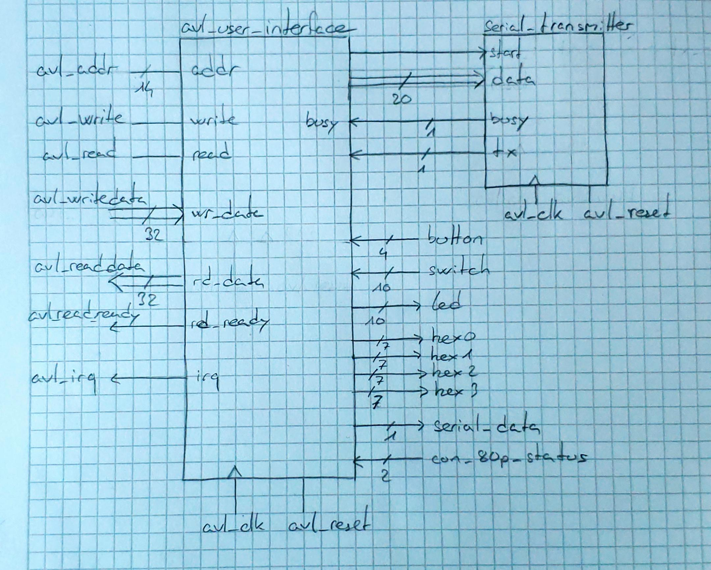

#### Émetteur série asynchrone
L'émetteur série permet la communication avec la carte MAX10_leds via un protocole série 20 bits :
- Vitesse de 9600 bauds
- Structure de trame : 1 bit start + 20 bits données + 1 bit stop
- Premier bit transmis : MSB
- Génération du timing basée sur l'horloge système de 50MHz

##### Schéma bloc
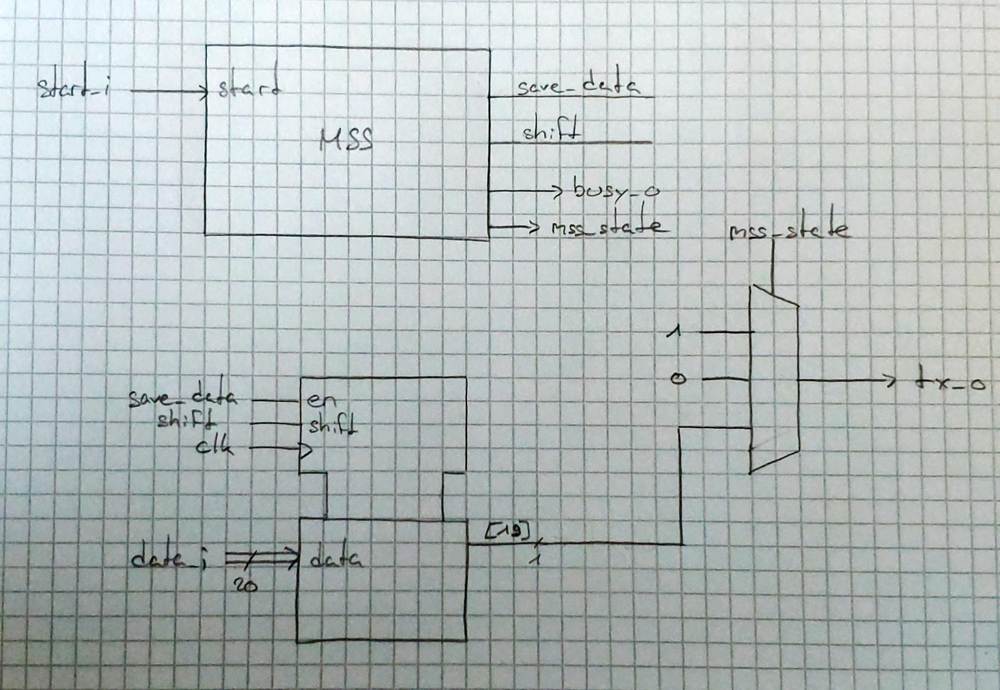

##### MSS
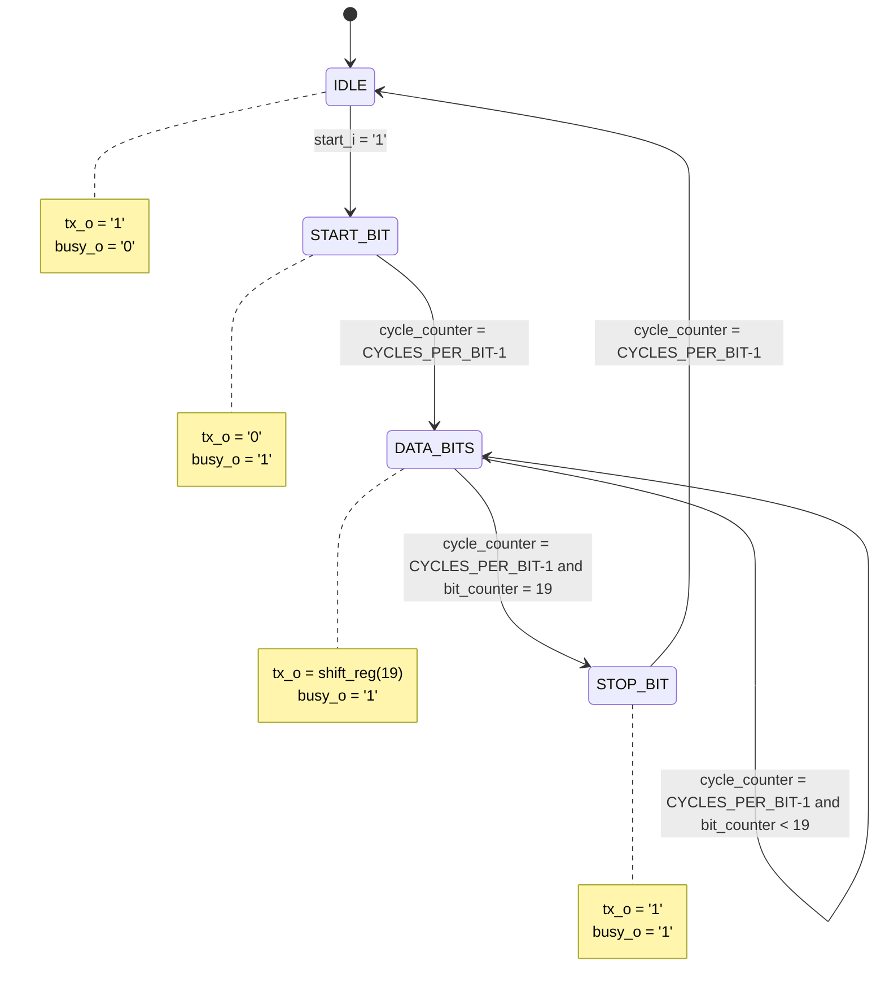

#### Gestionnaire d'interruptions
Le système d'interruption détecte et gère les appuis sur le bouton KEY0 :
- Détection de flanc descendant (car bouton actif bas)
- Registre de masquage pour activer/désactiver les interruptions
- Mécanisme d'acquittement par écriture
- Signal d'interruption vers le CPU

Ce composant est intégré à avl_user_interface.

##### Schéma bloc

#### Compteur de précision
Le compteur fournit une base de temps précise pour les mesures :
- Compteur 32 bits
- Précision de 20ns (basé sur l'horloge 50MHz)
- Contrôles start/stop et reset
- Lecture non bloquante de la valeur actuelle

Ce composant est intégré à avl_user_interface.

##### Schéma bloc


## Code C
### Define, struct et enum
Pour les adresses des registres, des constantes ont été définies en suivant le plan d'adressage de l'interface Avalon:
```c
#define ID_OFFSET 0x0
#define BOUTON_OFFSET 0x4
#define SWITCH_OFFSET 0x8
#define LED_OFFSET 0xc
#define HEX_OFFSET 0x10

#define SERIAL_STAT_R 0x14
#define SERIAL_DATA_R_W 0x18
#define SERIAL_START_W 0x1C
#define INTERRUPT_STATUS_R 0x20
#define INTERRUPT_ACK_W 0x20
#define INTERRUPT_MASK_W 0x24
#define COUNTER_VALUE_R 0x30
#define COUNTER_ACTION_W 0x34
```
D'autres constantes importantes ont été définies afin de pouvoir utiliser la communication UART:
```c
#define UART0_BASE 0xFFC02000
#define UART_REG(_x_) ((volatile uint32_t *)(UART0_BASE + _x_)) // _x_ is an offset with respect to the base address
#define UART0_THR 0x0											// Transmit Holding Register
#define UART0_DLL 0x0											// Divisor Latch Low Register
#define UART0_DLH 0x4											// Divisor Latch High Register
#define UART0_LSR 0x14											// Line Status Register
#define UART0_LCR 0xC											// Line Control Register
#define LSR_THRE (1 << 5)										// Transmit Holding Register Empty flag
#define UART0_FCR 0x8											// Offset du FIFO Control Register
#define FCR_FIFO_ENABLE 0x1										// Activer les FIFO en émission et réception
```
Finalement, dans les choses importante à mentionner sont 2 struct et 2 enum.
La première struct est `data_time` qui permet de stocker les données de temps de réaction tels que le meilleurs temps, le pire temps, le nombres d erreurs, d'essaies et le dernier temps mesurer.
Ensuite la deuxième permet juste de passer d'une mesure sur 32 bit à une valeur sur quatre variable pour représenter le temps sur les 4 afficheurs sept segments.
Finalement, l'enum `game_state_t` permet de définir les différents états de la machine d'états qui gère la logique du programme dans la boucle principale et l'enum `state_t` est utilisé pour définir les figures à afficher sur la carte MAX10.

```c
// State of the game
typedef enum
{
	WAITING,
	START,
	END,
	OFF
} state_t;

// State machine for the game
typedef enum
{
    GAME_IDLE,
    GAME_WAITING,
    GAME_REACTING,
    GAME_FINISHED
} game_state_t;

// Data structure for the game
typedef struct
{
	uint32_t best_time;
	uint32_t worst_time;
	uint32_t last_time;
	uint32_t total_errors;
	uint32_t total_attempts;
} data_time;

// Struct that represent a number
typedef struct
{
	uint32_t millier;
	uint32_t centieme;
	uint32_t dizaine;
	uint32_t unite;
} number_t;
```
### Communication seriel, compteur et interruptions
La gestion de la communication série, des interruptions et du compteur ont été géré de la même manière qu'avec les leds ou les switchs. Pour la communication série, plusieurs fonctions permettent de lire et d'écrire des données à travers les registres de bus. La fonction `Serial_status_read` interroge l'état de la transmission en récupérant les trois bits de statut pertinents afin de savoir si une transmission est en cours par exemple. Les fonctions `Serial_data_write` et `Serial_data_read` permettent chacune d'écrire et de lire les 20 bits de données, combinant 4 bits de commande et 16 bits de contenu. Enfin, la fonction `Serial_start` déclenche ou arrête une transmission en définissant le bit approprié dans le registre de contrôle. Ainsi, afin de pouvoir controler la transmission série, pour allumer les leds de la carte MAX10, il faut appeler ces fonctions dans un certain ordre.

D'abord, on doit s'assurer que la carte est connectée et valide, puis on écrit les données à transmettre, on démarre la transmission et on attend qu'elle se termine. Comme il y a plusieurs zone de leds sur la Max10, on a besoin de préciser le code précis de la zone à allumer. Nous utilisons uniquement le carré central pour afficher nos figues. C'est pour cela que en plus des data à transmettre, on doit préciser le code de la zone à allumer. La fonction `Max10_show_figure` va donc montrer la figure sur la carte MAX10 mais appelle `Max10_set_leds` 2 fois car le carré est divisé en 2 zones.
```c
bool Max10_set_leds(uint32_t zone_code, uint16_t led_data)
{
    // Check if the Max10 is connected
    uint32_t status = Serial_status_read();
    if ((status & 0x03) != 0x01)
    {
        printf("Erreur : Max10 non valide ou non connecté (statut : 0x%x)\n", status);
        return false;
    }

    // Build the data to send
    uint32_t data_to_send = ((zone_code & 0xF) << 16) | (led_data & 0xFFFF);

    // Write the data
    Serial_data_write(data_to_send);

    // Start the transmission
    Serial_start(true);

    // Wait for the transmission to finish
    while (Serial_status_read() & (1 << 2))
    {

    }

    return true;
}

void Max10_show_figure(state_t figure)
{
    switch (figure)
    {
    case WAITING:
        Max10_set_leds(ZONE_L, VAL_WAITING & FIGURE_MASK);
        Max10_set_leds(ZONE_H, (VAL_WAITING >> 16) & FIGURE_MASK);
        break;
        (...)
    }
}
```
La gestion des interruptions est réalisée via trois fonctions ainsi que la configuration du GIC comme on a pu le faire avec le timer dans un précédent labo mais en précisant notre numéro d'interruption qui est celui de `FPGA_IRQ0_ID` avec le numéro 72. La fonction `Interrupt_status_read` vérifie si une interruption est en attente (bit 0) et si le masque d'interruption est activé (bit 1). Pour acquitter une interruption une fois qu'elle a été traitée, la fonction `Interrupt_ack` écrit un '1' dans le registre associé, ce qui permet de réinitialiser son état. Enfin, la fonction `Interrupt_mask_set` active ou désactive globalement les interruptions en modifiant le bit de masque.

Le compteur de précision, quant à lui, fournit les fonctions pour la lecture, le contrôle et la réinitialisation de sa valeur. La fonction `Counter_get_value` renvoie la valeur actuelle du compteur convertie en millisecondes, en prenant en compte la précision de 20ns par incrément. Les fonctions `Counter_start`, `Counter_stop` et `Counter_reset` permettent de contrôler son état en activant ou désactivant le comptage, ou en le réinitialisant à zéro, respectivement en utilisant la fonction `Counter_action` qui permet de combiner les bits de contrôle.

```c
double Counter_get_value(void)
{
    volatile uint32_t *counter_value = INTERFACE_REG(COUNTER_VALUE_R);
    double value = (double)(*counter_value);

    // Return the value in ms
    return ((value * 20.0) / 1000000.0);
}
void Counter_action(bool enable, bool reset)
{
    volatile uint32_t *counter_action = INTERFACE_REG(COUNTER_ACTION_W);
    uint32_t value = (reset << 1) | (enable << 0); // Combinaison des bits
    *counter_action = value;
}
void Counter_start(void)
{
    Counter_action(0x1, 0x0); 
}
void Counter_stop(void)
{
    Counter_action(0x0, 0x0); 
}
void Counter_reset(void)
{
    Counter_action(0x0, 0x1);
}
```

### Communication UART

Les fonctions dédiées à la communication UART permettent de configurer et d'envoyer des données à travers une interface série avec des réglages précis. La fonction `uart_init` initialise la configuration de l'UART. Elle définit le mode de communication avec 8 bits de données, 1 bit de stop et aucun bit de parité, grâce au registre `LCR` (Line Control Register). Pour fixer la vitesse de communication à 9600 bauds, elle configure les registres DLL (Divisor Latch Low) et DLH (Divisor Latch High) en activant temporairement le bit DLAB (Divisor Latch Access Bit) du registre `LCR` pour faire cette configuration car les registre DLL et DLH ne sont accessibles que si DLAB est à 1 car sinon elles permettent de configurer d'autres paramètres de l'UART. Le calcul est fait en fonction de la fréquence de l'horloge système et de la vitesse de transmission souhaitée. Le baudrate est fixé à 9600 bauds et prends en compte la `Fréquence Clock Sérier (l4_sp_clk)` de 100MHz divisé par 16 * le divisor qui doit être trouvé (le calcul provient de la documentation). Donc le calcul pour trouvé le divisor est 
$Divisor = \frac{\text{Fréquence Clock Série}}{16 \times \text{Baudrate}} =  \lfloor  \frac{100}{16 \times 9600} \rfloor = \lfloor 651.0416666666667 \rfloor \approx {651} = \text{0x28B}$
Ainsi, les registres DLL et DLH sont configurés avec les valeurs 0x8B et 0x02 respectivement pour obtenir la vitesse de 9600 bauds. 
Il faut aussi activer les FIFO avec le registre `FCR` pour la gestion des données entrantes et sortantes.

```c
void uart_init()
{
    volatile uint32_t *uart0_lcr = UART_REG(UART0_LCR);
    volatile uint32_t *uart0_dll = UART_REG(UART0_DLL);
    volatile uint32_t *uart0_dlh = UART_REG(UART0_DLH);
    volatile uint32_t *uart0_fcr = UART_REG(UART0_FCR);

    *uart0_lcr = 0x03;
    *uart0_lcr |= 0x80;  
    *uart0_dll = 0x8B; 
    *uart0_dlh = 0x02;  
    *uart0_lcr &= ~0x80; 
    *uart0_fcr = 0x01; 
}
```

La fonction `uart_send_string` est utilisée pour transmettre une chaîne de caractères. Elle parcourt la chaîne caractère par caractère et écrit chaque élément dans le registre `THR` (Transmit Holding Register) de l'UART, tout en vérifiant que ce dernier est prêt à recevoir de nouvelles données (grâce au bit `LSR_THRE` du Line Status Register). Si l'option `add_newline` est activée, la fonction ajoute une nouvelle ligne (\r\n) à la fin du message pour respecter le format attendu par les terminaux série (ou en tout cas pour éviter les problèmes d'affichage que nous avons eu si on ne mettait pas le \r).
```c
void uart_send_string(const char *str, bool add_newline)
{
    volatile uint32_t *uart0_thr = UART_REG(UART0_THR);
    volatile uint32_t *uart0_lsr = UART_REG(UART0_LSR);
    while (*str)
    {
        // Wait for the THR to be empty
        while (!(*uart0_lsr & LSR_THRE))
        {
            
        }
        // Write the character to the UART in the THR register
        *uart0_thr = *str;
        str++;
    }
    // Add a newline if requested
    if (add_newline)
    {
        while (!(*uart0_lsr & LSR_THRE))
        {
        }
        *uart0_thr = '\r';
        while (!(*uart0_lsr & LSR_THRE))
        {
        }
        *uart0_thr = '\n';
    }
}
```
Enfin, la fonction uart_send_number facilite l'envoi de nombres entiers. Elle convertit le nombre en une chaîne de caractères à l'aide de la fonction `snprintf` et l'envoie via uart_send_string. Si un suffixe (comme " ms" pour les millisecondes) est fourni, il est également ajouté au message. 

```c
void uart_send_number(uint32_t number, const char *suffix)
{
    char buffer[12];

    // Formate the number to a string                                
    snprintf(buffer, sizeof(buffer), "%u", number);
    uart_send_string(buffer, false);                

    if (suffix)
    {
        uart_send_string(suffix, false);
    }

    uart_send_string(" ", true);
}
```

Ces fonctions permettent une communication série fiable, configurable et adaptée aux besoins de l'application, notamment pour afficher les résultats des mesures ou transmettre des informations à l'utilisateur via un terminal distant.

### Programme principale
Au démarrage, plusieurs périphériques sont configurés :
Les LEDs sont éteintes (Leds_write) et les afficheurs 7 segments sont initialisés à 0 (Seg7_write_hex).
Les interruptions sont configurées et activées grâce aux fonctions `config_GIC`, `set_A9_IRQ_stack` et `enable_A9_interrupts` ainsi que l'uart est initialisé et les interruptions activées.
Un identifiant unique (interface ID) est lu depuis l'Avalon pour vérifier la connexion, et les LEDs du MAX10 sont également initialisées éteinte.
Dans la boucle principale, la valeur des switches et des boutons afin de pouvoir afficher les valeurs des diférents temps sur les afficheurs 7 segments. Un `switch - case` permet de gérer les différents états qui gèrent la logique du programme. 


```c
 case GAME_IDLE:

            // In case we pushed the button when the game isn't active
            pushed = false;
            early_reaction = false;
            if (key_curr_state && !key_prev_state)
            {

                random_wait_time = (rand() % 4) + 1;
                Counter_reset();
                Counter_start();
                Max10_show_figure(WAITING);
                game_state = GAME_WAITING;
                uart_send_string("\r\nDébut du jeu! Attendez le carré pour appuyer sur KEY0.", true);
            }

            break;
```
- `GAME_IDLE` :
Cet état représente l'attente avant de commencer une nouvelle mesure. Lorsque le bouton `KEY1` est pressé (détection par flanc), un délai aléatoire entre 1 et 4 secondes est généré, le compteur est réinitialisé et démarré, et un symbole d'attente est affiché sur le MAX10. Le jeu passe alors à l’état `GAME_WAITING`.

```c
  case GAME_WAITING:
            // Wait for the random time to be elapsed
            if (Counter_get_value() >= random_wait_time * 1000)
            {                                              
                Max10_show_figure(START);                 
                reaction_start_time = Counter_get_value(); 

                game_state = GAME_REACTING;
                
                break;
            }
            else if (pushed)
            {
                early_reaction = true;
                game_state = GAME_REACTING;
            }
            break;
```

- `GAME_WAITING` :
Pendant cet état, le programme attend que le temps aléatoire soit écoulé. Si le joueur appuie trop tôt sur le bouton KEY0, cela est enregistré comme une erreur (`early_reaction`), et le jeu passe à l’état GAME_REACTING. Sinon, après le délai, un symbole de départ est affiché et l’état change pour `GAME_REACTING`.

```c
case GAME_REACTING:
    if (pushed)
    {
        reaction_time = Counter_get_value() - reaction_start_time;

        if (early_reaction)
        {
            times_game.total_errors++;
            Max10_show_figure(OFF);
            game_state = GAME_IDLE;
            afficher_resultats_uart(times_game, reaction_time, true);
            early_reaction = false;
        }
        else
        {

            times_game.last_time = reaction_time;
            times_game.best_time = times_game.best_time == 0 ? reaction_time : min(times_game.best_time, reaction_time);
            times_game.worst_time = max(times_game.worst_time, reaction_time);
            times_game.total_attempts++;
            Max10_show_figure(END);
            afficher_resultats_uart(times_game, reaction_time, false);
            game_state = GAME_FINISHED;
        }

        pushed = false;
    }

    break;
```

- `GAME_REACTING` :
Ici, le joueur doit réagir en appuyant sur `KEY0`. Si l'utilisateur a appuyé trop tôt (indiqué par `early_reaction`), cela est enregistré comme une erreur, et le jeu retourne à l’état `GAME_IDLE`. Sinon, le temps de réaction est calculé à partir de la valeur du compteur. Les statistiques du joueur (meilleur temps, pire temps, nombre d’erreurs et de tentatives) sont mises à jour avec les fonctions `min` et `max` qui ont été définit plus haut dans le code  . Le jeu passe alors à l’état `GAME_FINISHED`.

```c
 case GAME_FINISHED:
            game_state = GAME_IDLE;
            break;
```

- `GAME_FINISHED` :
Dans cet état, le programme retourne simplement à l’état `GAME_IDLE`, prêt pour une nouvelle mesure.
<br>

Finalement, le handler d'interruption est défini pour gérer les interruptions de l'appuie du bouton `KEY0`. Lors de l'appuie, le handler est sensé être le plus court possible afin de ne pas bloquer le CPU trop longtemps. Donc, il change l'état de la led, acknoledge l'interruption, active le flag `pushed` pour indiquer que le bouton a été appuyé et arrête le compteur. C'est la machine d'état de la boucle principale qui va gérer le reste.

```c
void fpga_ISR(void)
{
    // Read registers to determine which peripheral has caused an interrupt
    uint32_t irq_status = Interrupt_status_read();
    uint32_t leds = Leds_read(LED9); 

    if (irq_status & 0x1)
    {
        Interrupt_ack();
        pushed = true;
        Leds_write(leds ^ LED9);
        Counter_stop();
    }
}
```
### Génération d'une vraie valeur aléatoire 

Pour répondre à la consigne demandant une vraie valeur aléatoire, l'idée est de l'implémenter en utilisant le matériel du hps avec le Global Timer. Le Global Timer est un registre matériel qui s'incrémente de manière continue à une fréquence très élevée (généralement synchronisée à l'horloge système). En capturant sa valeur exacte au moment où l'utilisateur appuie sur la touche KEY1, nous aurions pu obtenir un nombre pseudo-aléatoire basé sur un événement imprévisible : le moment exact où la touche est pressée.
Par manque de temps et surcharge de labo, nous n'avons pas pu implémenter cette fonctionnalité et avons utiliser la fonction `srand(time(NULL))` et `rand()` pour générer des valeurs aléatoires. 


## Code VHDL
### entity avl_user_interface
#### Constantes 
##### Identification et de Configuration
```vhdl
constant INTERFACE_ID   : std_logic_vector(31 downto 0) := x"CAFE3456";
constant CLK_FREQUENCY  : integer := 50_000_000;    
constant BAUD_RATE      : integer := 10_000_000;
```
- `INTERFACE_ID` est l'identifiant unique de l'interface, utilisé pour valider la communication avec le bon périphérique.
- `CLK_FREQUENCY` définit la fréquence de l'horloge système utilisé par le composant serial_transmitter à 50MHz.
- `BAUD_RATE` définit la vitesse de transmission série à 9600 bauds pour le composant serial_transmitter.

##### Adressage en Lecture
```vhdl
constant ADDR_ID_R          : std_logic_vector(7 downto 0) := x"00";
constant ADDR_BUTTONS_R     : std_logic_vector(7 downto 0) := x"01";
constant ADDR_SWITCHES_R    : std_logic_vector(7 downto 0) := x"02";
constant ADDR_LEDS_R        : std_logic_vector(7 downto 0) := x"03";
constant ADDR_DISP_R        : std_logic_vector(7 downto 0) := x"04";
constant ADDR_SERIAL_STAT_R : std_logic_vector(7 downto 0) := x"05";
constant ADDR_SERIAL_DATA_R : std_logic_vector(7 downto 0) := x"06";
constant ADDR_IRQ_STATUS_R  : std_logic_vector(7 downto 0) := x"08";
constant ADDR_CNT_VALUE_R   : std_logic_vector(7 downto 0) := x"0C";
```
Ces constantes définissent les adresses de lecture pour :
- L'identifiant de l'interface (0x00)
- Les entrées physiques (boutons 0x01, switches 0x02)
- Les sorties (LEDs 0x03, afficheurs 7-segments 0x04)
- La communication série (status 0x05, données 0x06)
- Le système d'interruption (status 0x08)
- Le compteur (valeur 0x0C)

##### Adressage en Écriture
```vhdl
constant ADDR_LEDS_W        : std_logic_vector(7 downto 0) := x"03";
constant ADDR_DISP_W        : std_logic_vector(7 downto 0) := x"04";
constant ADDR_SERIAL_DATA_W : std_logic_vector(7 downto 0) := x"06";
constant ADDR_SERIAL_START_W: std_logic_vector(7 downto 0) := x"07";
constant ADDR_IRQ_ACK_W     : std_logic_vector(7 downto 0) := x"08";
constant ADDR_IRQ_MASK_W    : std_logic_vector(7 downto 0) := x"09";
constant ADDR_CNT_CTRL_W    : std_logic_vector(7 downto 0) := x"0D";
```
Ces constantes définissent les adresses d'écriture pour :
- Le contrôle des LEDs (0x03) et des afficheurs 7-segments (0x04)
- La transmission série (données 0x06, démarrage 0x07)
- La gestion des interruptions (acquittement 0x08, masque 0x09)
- Le contrôle du compteur (0x0D)

Toutes ces adresses sont sur 8 bits car elles correspondent à la partie basse de l'adresse Avalon, la partie haute étant décodée ailleurs dans le système.


#### Process 
##### Read decoder (read_decoder_p)
Le processus de décodage de lecture est un processus combinatoire qui prépare les données pour le bus Avalon. Lorsqu'une demande de lecture arrive via le signal avl_read_i, le processus examine l'adresse fournie et prépare la donnée correspondante dans le signal readdata_next_s. Les données peuvent provenir des registres internes comme les LEDs, ou directement des entrées comme les boutons et les interrupteurs. Le processus indique également la validité de la donnée en activant le signal readdatavalid_next_s. En l'absence de demande de lecture, les signaux sont maintenus à zéro pour éviter toute lecture non désirée.

##### Read register (read_register_p)
Ce processus synchrone constitue la seconde étape du pipeline de lecture. Son rôle est de synchroniser les données préparées par le décodeur avec l'horloge du système. À chaque front montant de l'horloge, il transfère les données préparées (readdata_next_s) vers le registre de sortie (reg_readdata) qui sera lu par le bus Avalon. De même, il propage le signal de validité. En cas de reset, les registres sont réinitialisés à zéro pour partir d'un état connu. Ce processus assure une lecture stable et synchronisée des données.

##### Write access (write_access_p)
Le processus d'écriture gère toutes les mises à jour des registres internes de l'interface. Lors d'une demande d'écriture identifiée par le signal avl_write_i, il décode l'adresse fournie pour déterminer quel registre doit être mis à jour. Il peut s'agir des LEDs, des registres de configuration de l'émetteur série, des registres de contrôle des interruptions ou encore du compteur. Le processus s'assure également de gérer correctement les signaux qui doivent être actifs pendant un seul cycle d'horloge, comme le signal de démarrage de la transmission série. En cas de reset, tous les registres sont initialisés à leurs valeurs par défaut.

##### Interrupt process (interrupt_p)
Le processus de gestion des interruptions surveille en permanence l'état du bouton KEY0. Il utilise deux registres : key0_prev qui mémorise l'état précédent du bouton, et irq_pending qui indique si une interruption est en attente de traitement. À chaque cycle d'horloge, il compare l'état actuel du bouton avec son état précédent pour détecter un appui. Lorsqu'un appui est détecté, il active le signal d'interruption. L'interruption reste active jusqu'à ce qu'elle soit acquittée par le CPU via le registre d'acquittement. En cas de reset, le système d'interruption est réinitialisé.


### entity serial_transmitter
#### Constantes 
##### Génériques
```vhdl
CLK_FREQ    : integer := 50_000_000;  -- 50 MHz
BAUD_RATE   : integer := 9600         -- 9600 bauds
```
Ces deux constantes sont définies comme génériques pour rendre le composant paramétrable :
- `CLK_FREQ` définit la fréquence de l'horloge d'entrée, par défaut à 50MHz
- `BAUD_RATE` spécifie la vitesse de transmission série, par défaut à 9600 bauds

##### Internes
```vhdl
constant CYCLES_PER_BIT : integer := CLK_FREQ / BAUD_RATE;
constant TX_DATA_WIDTH  : integer := 20;
```
- `CYCLES_PER_BIT` calcule le nombre de cycles d'horloge nécessaires pour un bit de donnée. Par exemple, pour 50MHz et 9600 bauds, on obtient 5208 cycles par bit.
- `TX_DATA_WIDTH` définit la largeur des données à transmettre, fixée à 20 bits pour notre protocole.

#### Processus Principal
Le transmetteur série utilise un seul processus synchrone qui implémente une machine à états pour gérer la transmission. Il comprend quatre états :

```vhdl
-- Types
type state_t is (IDLE, START_BIT, DATA_BITS, STOP_BIT);
```

##### État IDLE (Repos)
Dans cet état, la ligne série est maintenue à '1' et le signal busy est désactivé. Lorsqu'une demande de transmission arrive (start_i = '1'), le processus :
- Charge les données d'entrée dans le registre à décalage
- Active le signal busy
- Passe à l'état START_BIT

##### État START_BIT
Cet état gère l'envoi du bit de start :
- Met la ligne série à '0'
- Attend CYCLES_PER_BIT cycles
- Passe ensuite à l'état DATA_BITS

##### État DATA_BITS
Cet état gère l'envoi des 20 bits de données :
- Envoie le bit de poids fort du registre à décalage
- Décale le registre à gauche chaque CYCLES_PER_BIT cycles
- Compte les bits envoyés
- Passe à l'état STOP_BIT une fois les 20 bits envoyés

##### État STOP_BIT
Cet état termine la transmission :
- Met la ligne série à '1'
- Attend CYCLES_PER_BIT cycles
- Retourne à l'état IDLE

Le processus gère aussi le reset asynchrone qui ramène le transmetteur à son état initial avec la ligne série à '1' et le signal busy désactivé.


##### MSS Quartus
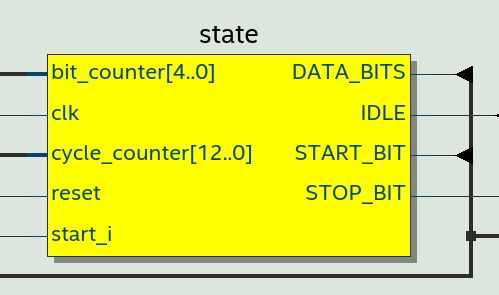
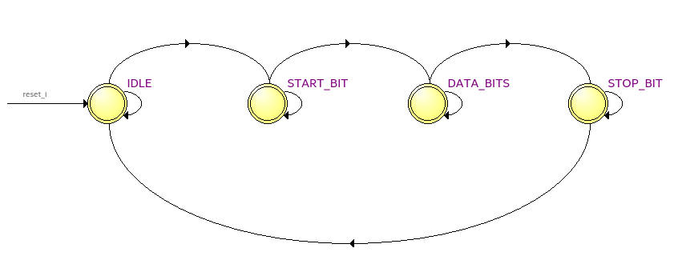


### Synthèse VHDL
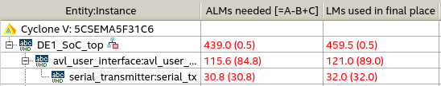


## Tests

### Console TCL/TK
Les premiers tests ont été réalisé grace à la console TCL/TK sur Questasim. Voici les adresses utilisés, les
valeurs d'écriture et les valeurs de lecture :


| R/W   | Adresse      | Value | Description |
| ----- | :----------- | :------------- | --- |
| R | 0x00 | 0xcafe3456 | Lecture de la constante de notre interface  |
| R | 0x04 | 0x3 | Lecture des boutons, S3 et S2 sont levés et comme les boutons sont actifs bas, on lit l'inverse de 0b1100 soit 0b0011 ce qui donne bien 0x3 |
| R | 0x08 | 0x5 | Lecture des interrupteurs, S2 et S0 sont levés ce qui donne 0b101 et donc 0x5 |
| W | 0x0C | 0x3F | Ecriture de la valeur 0b111111 sur le port des LEDs pour allumer les LEDs 0 à 5 |
| R | 0x0C | 0x3F | Lecture des LEDs pour vérifier que la donnée précédemment écrite a été sauvegardé dans le registre |
| R | 0x10 | 0x0FFFFFFF | Lecture des afficheurs 7 segments, les segments sont actif bas|
| R | 0x14 | 0x0 | Lecture du status de la transmission série, busy est à 0, aucune transmission n'est en cours |
| W | 0x18 | 0xAA | Ecriture de la valeur 0xAA dans le registre data de la transmission série  |
| R | 0x18 | 0xAA | Lecture du registre data de la transmission série pour vérifier que l'écriture a fonctionné |
| W | 0x1C | 0x1 | Ecriture du bit 0 du registre SERIAL_START pour démarrer la transmission  |
| R | 0x14 | 0x4 | Lecture du status de la transmission série, busy est à 1, une transmission est en cours |
| R | 0x20 | 0x00 | Lecture du status d'interruption, bit 0 (pending) à 0, par d'interruption en cours et bit 1 (mask) à 0, par d'interruption activé |
| W | 0x24 | 0x1 | Set à '1' le bit 0 pour masquer (activer) l'interruption sur le bouton 0 (KEY0) |
| R | 0x20 | 0x2 | Lecture du status d'interruption, bit 1 (mask) à 1, interruption sur KEY0 activé |
| R | 0x30 | 0x0 | Lecture du compteur de précision, il est bien initialement à 0 |
| W | 0x34 | 0x1 | Set à '1' le bit 0 pour activer le compteur |
| R | 0x30 | 0x2 | Lecture du compteur de précision, le compteur s'incrémente |
| R | 0x30 | 0x5 | Lecture du compteur de précision, le compteur s'incrémente |
| W | 0x34 | 0x3 | Set à '1' le bit 0 et 1 pour reset la valeur du compteur et le réactiver |
| R | 0x30 | 0x2 | Lecture du compteur de précision, le compteur a bien été reset |


La console TCL/TK :

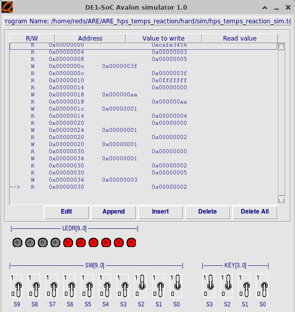

Et le chronogramme résultant :

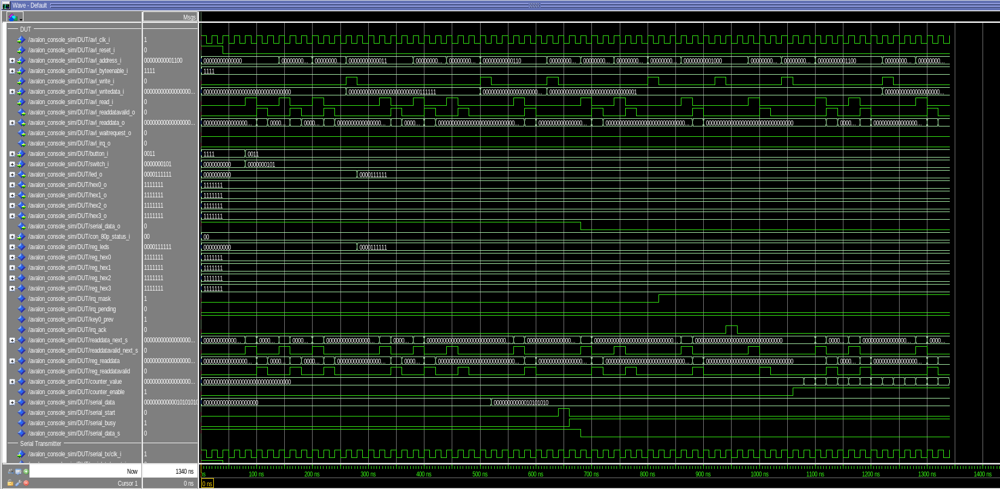

Le chronogramme nous a permis d'observer 1 erreur du code VHDL.
Lors de la lecture de SERIAL_STATUS, la valeur de lecture était indéfinie :

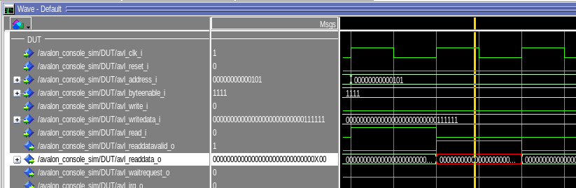

C'était du au fait que dans le composant `serial_transmitter` le signal `busy_o` n'était pas mis à 0 lors d'un reset asynchone.

Mais malgé cette correction, les signaux `busy_o` et `tx_o` réstaient indéfini dans la simulation.
Pourtant la compilation Quartus et la vue RTL n'indiquait pas de problème.

Après de nombreuse heures de recherche en vain, nous avons sollicité l'aide du professeur Etienne Messerli qui nous a fait remarqué qu'il manquait le bout de code ci-dessous dans la déclaration du composant `serial_transmitter` dans `avl_user_interface.vhd`
```vhdl
for all : serial_transmitter use entity work.serial_transmitter;
```

#### Transmission série
Chronogramme d'une transmission série avec un baudrate défini à 10_000_000 pour simplifier la simulation.
Envoi de la valeur 0xAA.
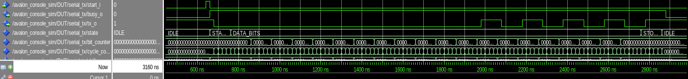


#### Interruption KEY0
Chronogramme du signal d'interruption et du son clear.

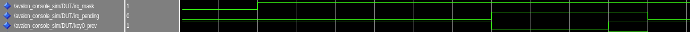


### Question
*Pourrait on utiliser un module UART du HPS pour piloter la liaison série asynchrone 20 bits vers la carte Max10_leds ? Justifier votre réponse*

Non, on ne peut pas utiliser directement un module UART du HPS pour piloter la liaison série asynchrone 20 bits vers la carte Max10_leds, car les modules UART standards ne supportent pas les trames non conventionnelles. Ils sont conçus pour des protocoles courants avec des trames de 5 à 9 bits de données, éventuellement un bit de parité, et 1 ou 2 bits de stop. Notre protocole utilise une trame de 1 bit de start, 20 bits de données et 1 bit de stop, ce qui dépasse les capacités des UART standards. De plus, les modules UART n'offrent pas un contrôle suffisamment précis de la ligne série pour garantir la synchronisation parfaite requise avec la carte Max10_leds. C’est pourquoi un émetteur série personnalisé a été développé dans le FPGA, spécifiquement conçu pour générer des trames conformes au protocole et compatibles avec les attentes de la carte Max10_leds.

## Conclusion

Le laboratoire a permis de développer avec succès une application complète de mesure du temps de réaction. Les objectifs ont été atteints :

- Interface UART fonctionnelle
- Communication série stable avec la carte Max10_leds
- Gestion précise du temps avec le compteur 20ns
- Système d'interruption efficace
- Application robuste et conviviale

Les tests ont démontré la fiabilité du système et sa capacité à mesurer précisément les temps de réaction des utilisateurs.
